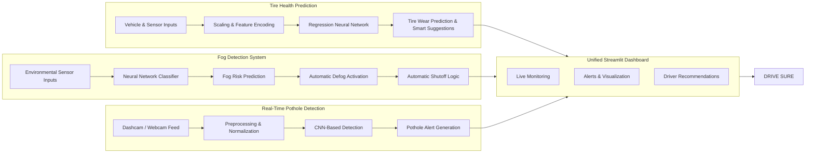

# 🚘 DriveSure — AI-Powered Unified Vehicle Safety & Diagnostics System

> **Think Fast. React Smarter. Drive Safer.**

DriveSure is an AI-powered smart vehicle safety and predictive diagnostics platform designed to improve road safety through real-time hazard detection, environmental monitoring, and intelligent vehicle health analysis.

The system combines **Computer Vision, Deep Learning, Sensor-Based Intelligence, and Interactive Analytics** into a unified Streamlit dashboard capable of detecting potholes, predicting fogging risk, and monitoring tire degradation in real time.

Built with accessibility and affordability in mind, DriveSure aims to bring advanced intelligent safety systems to everyday vehicles rather than limiting them to premium automotive ecosystems.

---

# 🌟 Key Highlights

✅ Real-time pothole detection using CNN-based vision models  
✅ Predictive fog risk analysis with automatic response logic  
✅ AI-based tire wear and degradation prediction  
✅ Unified multi-tab Streamlit dashboard  
✅ Webcam-enabled live road monitoring  
✅ Smart alerts and driver recommendations  
✅ Modular and scalable architecture for future automotive integrations  

---

# 🎯 Problem Statement

Road transportation continues to face major safety challenges due to:

- Poor road infrastructure and potholes
- Low visibility caused by fog
- Lack of affordable tire monitoring systems
- Delayed detection of hazardous driving conditions

Existing intelligent vehicle safety systems are often restricted to high-end vehicles and expensive hardware ecosystems.

DriveSure addresses this gap by providing a **low-cost AI-powered monitoring solution** that can operate using simulated inputs, webcams, and lightweight machine learning pipelines.

---

# 🧠 System Objectives

The primary objective of DriveSure is to:

- Improve road safety using AI-driven hazard detection
- Predict dangerous environmental conditions before they escalate
- Assist drivers with real-time alerts and recommendations
- Enable predictive vehicle maintenance using intelligent analytics
- Build a scalable and accessible smart mobility framework

---

# 🏗️ Solution Architecture

DriveSure integrates three intelligent subsystems into one centralized dashboard:

- 🌫️ Fog Detection System
- 🛣️ Pothole Detection System
- 🛞 Tire Health Prediction System

Each module operates independently while sharing predictions and alerts through a unified analytics interface.

---

# 🔄 Workflow Architecture



# 🌫️ Fog Detection Module

## Inputs
- Inside Temperature
- Outside Temperature
- Relative Humidity
- Dew Point
- Air Recirculation Status

## Model
A neural network trained on environmental sensor conditions predicts cabin fogging probability.

## Smart Response System

When fog is detected:

- Warm-air defogger activates automatically
- AC system is triggered simultaneously
- Twin-actuation logic ensures redundancy and reliability

## Output
- Fog risk classification
- Automatic defogging response
- Real-time dashboard alerts

## Innovation
DriveSure introduces a predictive and automatic fog response mechanism suitable even for low-cost vehicles.

---

# 🛣️ Pothole Detection Module

## Inputs
- Live webcam/dashcam feed
- Uploaded road images

## Model
CNN-based image classification model trained on pothole and normal road datasets.

## Features
- Real-time pothole recognition
- Live alert generation
- Webcam integration using WebRTC
- UI-based confidence visualization

## Future Scope
- Geo-tagging and automated authority notifications for damaged roads

---

# 🛞 Tire Health Prediction Module

## Inputs

The model processes multiple vehicle and environmental parameters including:

- Speed
- Brake Pressure
- Steering Position
- Ambient Temperature
- Humidity
- Tire Temperature
- Tread Depth
- Friction Coefficient
- Driving Style Metrics

## Model
A regression-based neural network predicts tire degradation levels using encoded sensor inputs.

## Output
- Tire wear prediction
- Maintenance recommendations
- Driving behavior insights
- Tire replacement suggestions

## Innovation
Unlike traditional TPMS systems, DriveSure predicts tire degradation using behavioral and environmental analysis, making it feasible for legacy and affordable vehicles.

---

# 📊 Unified Dashboard Experience

The Streamlit-based dashboard provides:

- Real-time monitoring
- Live pothole detection
- Tire health analytics
- Fog condition alerts
- Smart recommendations
- Multi-tab interactive visualization

## Unique Value
DriveSure combines multiple intelligent automotive safety modules into a single lightweight platform.

---

# 📈 Results & Performance

| Module | Performance |
|---|---|
| Fog Detection Accuracy | 92% |
| Pothole Detection Accuracy | 88.63% |
| Best Validation Accuracy | 90% |
| Tire Prediction MSE | 0.0296 |
| Tire Prediction MAE | 0.0835 |

## Impact
- Potential reduction in fog-related accidents
- Improved predictive maintenance awareness
- Enhanced road hazard monitoring

---

# 🧪 Technical Stack

| Technology | Usage |
|---|---|
| Python | Core Development |
| TensorFlow / Keras | Deep Learning Models |
| scikit-learn | ML Utilities |
| OpenCV | Computer Vision |
| Streamlit | Interactive Dashboard |
| streamlit-webrtc | Webcam Streaming |
| NumPy & Pandas | Data Processing |

---

# 📂 Project Structure

```text
DriveSure/
│
├── models/
│   ├── fog_detection_model.pkl
│   ├── fog_scaler.pkl
│   ├── pothole_model.h5
│   ├── scaler-2.pkl
│   └── tire_degradation_nn_model.h5
│
├── dashboard.py
├── requirements.txt
├── tire_predictions.csv
├── car_animation.json
├── README.md
└── .gitignore
```

---

# ⚙️ Installation & Setup

## Clone Repository

```bash
git clone https://github.com/32732Nikitha/Tata-Innovation-26_DriveSure.git
cd Tata-Innovation-26_DriveSure
```

---

## Create Virtual Environment

### Linux / macOS

```bash
python3 -m venv venv
source venv/bin/activate
```

### Windows

```bash
python -m venv venv
venv\Scripts\activate
```

---

## Install Dependencies

```bash
pip install -r requirements.txt
```

---

# ▶️ Running the Application

```bash
streamlit run dashboard.py
```

The dashboard launches locally in your browser.

---

# 🚀 Future Enhancements

- GPS-based pothole geo-tagging
- Cloud-based analytics integration
- OBD-II and CAN bus integration
- Driver drowsiness monitoring
- Tire sensor emulation systems
- Mobile application deployment

---

# ⚠️ Challenges Faced

- Limited Indian road-condition datasets
- Integration of heterogeneous AI modules
- Real-time Streamlit video latency optimization
- Simulated validation without hardware sensors

---

# 👨‍💻 Team — Neo Karma

## Creators of DriveSure

- [Dorbala Sai Nikitha — CSE (IRD)](https://github.com/32732Nikitha)
- [Dorbala Sai Sujitha — CSE (IRD)](https://github.com/2300030861)
- [Chennupalli Laxmi Varshitha — CS&IT (IRD)](https://github.com/LaxmiVarshithaCH)
- [Chittelu Nissy — CSE (IRD)](https://github.com/2300030144)

---

# 🏫 Presented By

**Koneru Lakshmaiah Education Foundation**  
Andhra Pradesh, India

---

# 🌍 Vision

DriveSure envisions a future where intelligent road safety systems are accessible, scalable, and affordable for every vehicle owner.

## Smarter Detection. Safer Roads. Better Journeys.
