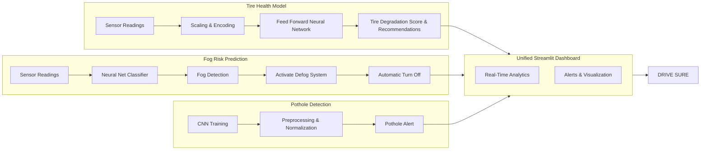

# 🚘 DriveSure — AI Powered Road Safety Intelligence

DriveSure is an intelligent vehicle safety monitoring platform designed to improve road awareness using real-time AI-driven hazard detection and predictive analytics. The system combines computer vision, machine learning, and interactive visualization to identify dangerous driving conditions before they become critical.

From pothole recognition to fog monitoring and tire condition prediction, DriveSure delivers a unified smart mobility safety solution through an interactive Streamlit dashboard.

---

# ✨ Core Capabilities

## 🌫️ Smart Fog Detection
Detects low-visibility environmental conditions using trained machine learning models and sensor-based analysis to assist safer driving decisions.

## 🛣️ Real-Time Pothole Recognition
Uses deep learning and computer vision techniques to identify potholes and damaged road surfaces from live video streams.

## 🛞 Tire Health Prediction
Predicts tire degradation levels using neural network-based analysis of vehicle and road-condition parameters.

## 📹 Live Video Monitoring
Supports webcam and live stream integration for continuous road condition analysis using WebRTC.

## 📊 Interactive Analytics Dashboard
Provides an intuitive Streamlit interface for monitoring predictions, alerts, and visual insights in real time.

## ⚡ Fast Deployment
Simple project setup with modular architecture for quick experimentation and deployment.

---

# 🏗️ System Architecture

The application follows a modular AI pipeline:

1. Video/Input Data Acquisition  
2. Real-Time Frame Processing  
3. Hazard Detection Models  
4. Prediction & Risk Analysis  
5. Dashboard Visualization & Alerts





---

# 📁 Project Structure

```text
DriveSure/
│
├── models/
│   ├── fog_detection_model.pkl
│   ├── fog_scaler.pkl
│   ├── pothole_model.h5
│   ├── scaler-2.pkl
│   └── tire_degradation_nn_model.h5
│
├── dashboard.py
├── requirements.txt
├── tire_predictions.csv
├── car_animation.json
├── README.md
└── .gitignore
```

---

# ⚙️ Installation Guide

## 1️⃣ Clone Repository

```bash
git clone https://github.com/32732Nikitha/Tata-Innovation-26_DriveSure.git
cd Tata-Innovation-26_DriveSure
```

---

## 2️⃣ Create Virtual Environment

### Linux / macOS

```bash
python3 -m venv venv
source venv/bin/activate
```

### Windows

```bash
python -m venv venv
venv\Scripts\activate
```

---

## 3️⃣ Install Dependencies

```bash
pip install -r requirements.txt
```

---

# 🤖 Required Models

Place all trained models inside the `models/` directory.

### Included Models

- `fog_detection_model.pkl`
- `fog_scaler.pkl`
- `pothole_model.h5`
- `tire_degradation_nn_model.h5`
- `scaler-2.pkl`

---

# ▶️ Running the Application

Launch the Streamlit dashboard:

```bash
streamlit run dashboard.py
```

After startup, the application opens in your browser automatically.

---

# 📈 Features Available in Dashboard

- Live pothole monitoring
- Fog condition alerts
- Tire wear prediction
- Real-time analytics visualization
- Webcam stream integration
- Interactive UI components

---

# 🧠 Technologies Used

| Technology | Purpose |
|---|---|
| Python | Core Development |
| Streamlit | Dashboard Interface |
| TensorFlow | Deep Learning Models |
| scikit-learn | ML Utilities |
| OpenCV | Image & Video Processing |
| streamlit-webrtc | Live Webcam Streaming |
| NumPy & Pandas | Data Processing |

---

# 👨‍💻 Contributors

- Dorbala Sai Nikitha
- Dorbala Sai Sujitha
- Chennupalli Laxmi Varshitha
- Chittelu Nissy

---

# 🚀 Future Enhancements

- GPS-based hazard mapping
- Driver drowsiness detection
- Lane departure monitoring
- Cloud-based analytics
- Mobile application integration
- Emergency alert system

---

# 📬 Support & Contributions

Contributions, improvements, and suggestions are welcome.

If you discover issues or want to enhance the platform:

- Create an issue
- Submit a pull request
- Share feature ideas

---

# 🌍 Vision

DriveSure aims to make transportation safer through intelligent automation, predictive road analysis, and accessible AI-powered monitoring systems.

### Smarter Detection. Safer Roads. Better Journeys.
